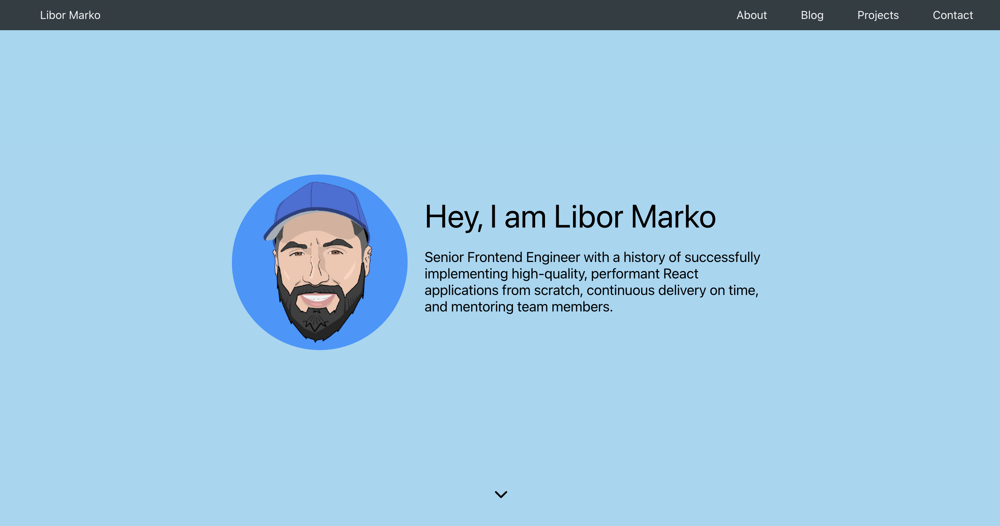

# A Personal Portfolio Webpage
This is my web development project. I built this personal portfolio webpage with front-end web development technologies. This site demonstrates the principles of responsive web design. The webpage has four main parts: About, Blog, Projects and Contact. Check the webpage [here](https://libormarko.github.io/) to find out more about me and my work.

## What I learned
* Basic HTML
* Basic CSS
* Applied Visual Design
* Responsive Web Design Principles
* Media Queries
* CSS Flexbox

## Technologies used
* HTML5
* CSS3, CSS Flexbox
* Media Queries

## Setup and Run
1. Download the project files
2. Extract all files from the zipped folder
3. Open the folder
4. Open the file called "index.html"

## Screenshot of the webpage
